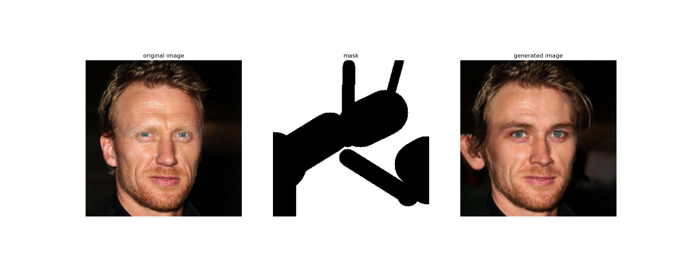
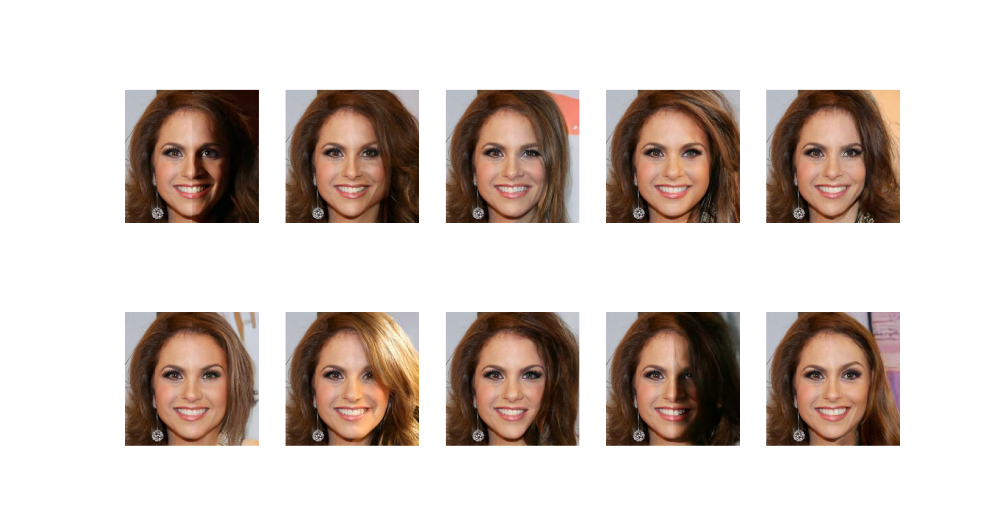

# RePaint

Implementation of the CVPR 2022 Paper "[RePaint](https://arxiv.org/pdf/2201.09865v4.pdf)":



The method is a stochastic generative inpainting algorithm.



If you use this repository, please cite the original authors.
These ideas are not mine, I'm just implementing them in a way that makes sense to me,
and in a way that can be **easily extended and applied**.

## Requirements

To run RePaint, you'll need the following:
1. A trained [Diffusion model](https://arxiv.org/abs/2006.11239) that is **callable**. 
Specifically, it must take noisy data and timestep `t` as input, 
and return the noise to be subtracted in that diffusion reverse step
2. The _original_ noise schedule for the diffusion model.
3. Data that you would like to inpaint, **in the same distribution as the training data**.

Additionally, a **GPU is highly recommended**, since this technique requires hundreds
of forward passes of a neural network. It will be incredibly slow without a GPU.
In my informal tests, a 256x256 image model, for 1000 diffusion steps takes about 2 minutes 
with a GPU and 2 hours without one.

This technique doesn't work well on data different from what it was trained on.
For example, here's what happens when you try to inpaint a landscape image
using a diffusion model trained on the CelebA-HQ dataset (faces):

## Dependencies

This project uses [Anaconda](https://www.anaconda.com/) to manage dependencies.

To install the dependencies:

```sh
conda create --name repaint
conda activate repaint
conda install TODO
```

## Glossary

This is a small guide to explain the naming conventions and terms used in the
repository
|Term|Explanation|
|---|---|
|`t`|the current timestep in the diffusion process|
|forward step|One step in noising the image. t -> t+1. Not to be confused with the _forward pass_ of a neural network|
|reverse step|one step in de-noising the image, handled by the neural network. t -> t-1.|
|`beta`|elements of the variance schedule. How much noise is being added at each step.|
|`alpha`|1-beta|
|`alpha_cumprod`|cumulative product of alphas, from 0 to t|
|jump length `j`|number of diffusion steps to jump in a resample|
|`r`|number of resamplings|

## Contributions
Contributions are welcome and encouraged! If you see a way to improve this repo, or have
and issue with running the code, please create an issue or a pull request.
